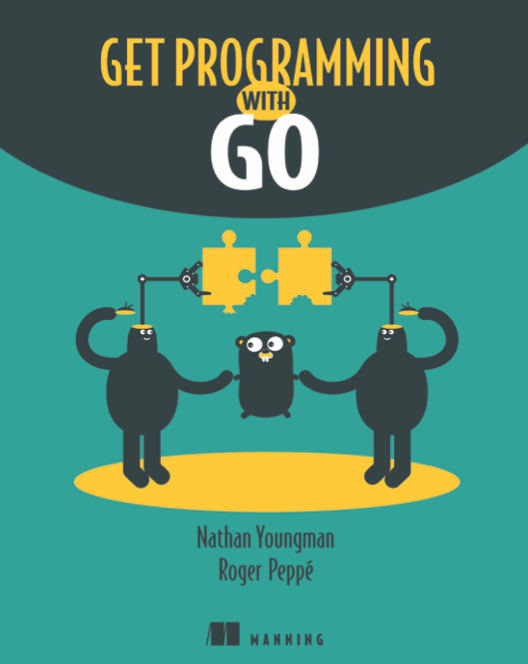

# Go Tutorial

This is a quick Golang tutorial for beginners or for someone who with previous experience and want to pick up Golang quickly. This tutorial is based on the book *Get Programming With Go* and will not make profit for any commercial usage.



## Content
* Unit 1: [Introduction](./unit_1/readme.md)
* Unit 2: [Types](./unit_2/readme.md)
* Unit 3: [Functions](./unit_3/readme.md)
* Unit 4: [Collections](./unit_4/readme.md)
* Unit 5: [OOP in Go](./unit_5/readme.md)
* Unit 6: Pointer (ongoing...)
* Unit 7: Concurrent (ongoing ...)

### Run Project
If you want to run the code for any examples or experiments. You just need to go to the corresponding directory `unit_{x}` and modify  `main()` in `assignment_{x}.go` to call the functions as you want, then run it.

e.g. run `main()` in `unit_1`

```
cd ./unit_1
go run . 
```

