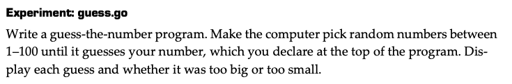
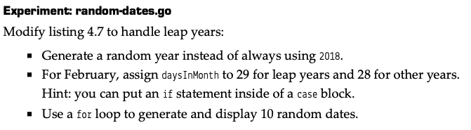
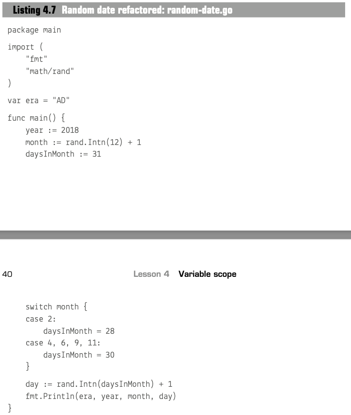

# Introduction
* general print
    ```
    fmt.Print()
    fmt.Println()
    ```
* formated print
    ```
    fmt.Printf("%-15v $%4v", "SpaceX",94)
    \\ output: SpaceX       $  94
    ```
    [example](assignment_1.go#L63)
* constant & variable
    ```
    const lightspeed=299792
    var distance,speed=56000000,100800
    ```
* short declaration
    ```
    distance:=56000000
    ```
* variable scope: `{}`
* package scope: 
`era` can be used in all functions in package `main`
    ```
    package main
    var era="AD"
    func main(){
        ...
    }
    ```

* increment operator
no "++" in Go, but `x+=1`

* random number gernerator: `rand.Intn(n int)`
  [example](assignment_1.go#L57)

##### Loops & branches
* branch structure: `if` and `switch & case`
  [example](assignment_1.go#L46)
* logical operators: `&&`, `||` and `!`
    ```
    var haveTorch = true
    var litTorch = false

    if !haveTorch || !litTorch {
        fmt.Println("Nothing to see here.")
    }
    ```
* `for` loops
    ```
    for i:=0;i<10;i++{
        fmt.Println(i)
    }
    ```
    [example](assignment_1.go#L69)

<br>

## Expermiment
- **Expermiment 1**  

[solution](assignment_1.go#L9)
<br>

- **Expermiment 2**  


[solution](assignment_1.go#L24)
<br>


