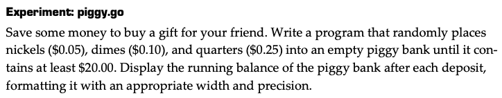
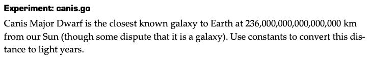
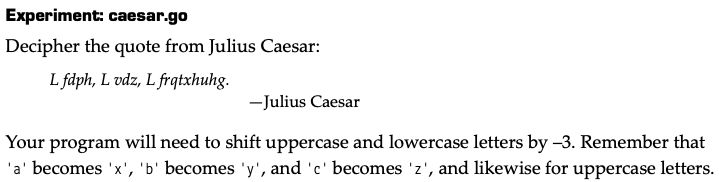
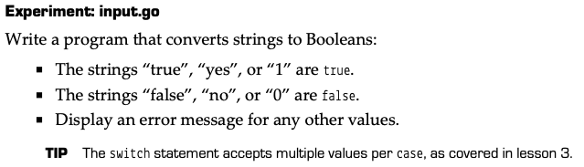

# Variable

* boolean
    * only `false` and `true` are valid values
    * do not accept `""` or `0`
* float
  * 2 precision types: `float64` & `float32`
  * default value: `0.0` 
  * claim a real number varialble: 
    ```
    days := 365.2425
    // must claim type when assign to integers 
    var answer float64 = 0
    ```
  * output: `fmt.Printf("%4.2f\n", 1.0/3)`
  [example](assignment_2.go#L62)
  * to calculate more precisely, first do multipulation then division
    ```
    21.0 * 9.0 / 5.0
    ```
  * compare values between float variables
    ```
    x := 0.1
    x += 0.2
    fmt.Println(math.Abs(x-0.3)<0.0001)
    ```
    [example](assignment_2.go#L72)
* int
  * 8 precision types: `int8`,`uint8`,`int16`,`uint16`,`int32`,`uint32`,`int64`,`uint64`
  * print the type of variables: `fmt.Printf("%T",x)`
  * print the bits of variables: 
    ```
    var green ynit8 = 3
    fmt.Printf("%b", x)
    ```
    [example](assignment_2.go#L81)
  * maximum value of `int`: `math.MaxInt16`
* big numbers
  * use `float`: `var distance float64 = 24e18`
  * use `big` lib：
    ```
    x := big.NewInt(299792)
    distance := new(big.Int)  // new() allocates memory for a value type instance and returns a pointer
    distnce.SetString("24000000000000000",10)
    ```
  * typed constant: 
  `const distance float64 = 240000000000000000`
  * untyped constant: 
  `const distance = 240000000000000000`
    * a untyped constant must be declared as `float` when assigning an integer that exceeds the range of `int`
    * [example](assignment_2.go#L89)
* string
  * declare a string:
    ```
    peace := "peace"
    var blank string  // default value: ""
    ``` 
  * string literal: `""`, escape characters are processed, such as `\n`
  * raw string literal: ` `` `, escape characters are not processed
  * character: `grade := 'A'`
  * character type: `byte` (ascii) and `rune` (utf8)
  * the number of bytes occupied by the string: `len()`, the number of Unicode characters in the string: `utf8.RuneCountInString(str)` 
  * traverse a string:
    ```
      for _,c := range str {
        fmt.Println(c)
      }

      // operate in rune array
      for i:=0;i<len(str);i++{
        c := str[i]
      }
    ```
    [example](assignment_2.go#L99)
* coverting between types
  * `int()`, `flaot64()`, `string()`
  * integer to string: `strconv.Itoa()` and `fmt.Sprintf()`
  * cannot convert `1` or `yes` into `bool`
    ```
    // will raise error
    bool(1)
    bool("yes")
    ``` 
<br>

## Expermiment
- **Expermiment 1**  

[solution](assignment_2.go#L9)
<br>

- **Expermiment 2**  

[solution](assignment_2.go#L20)
<br>

- **Expermiment 3**  

[solution](assignment_2.go#L28)
<br>

- **Expermiment 4**  

[solution](assignment_2.go#L49)
<br>