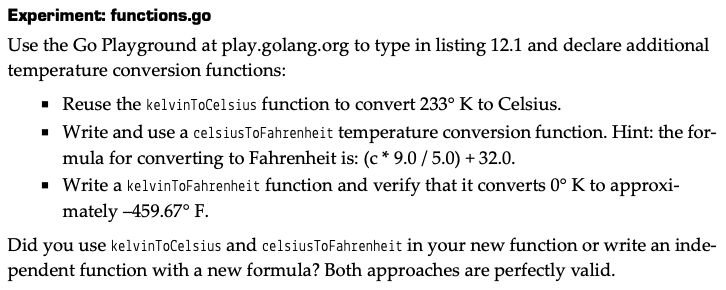
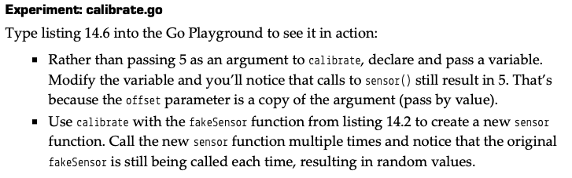
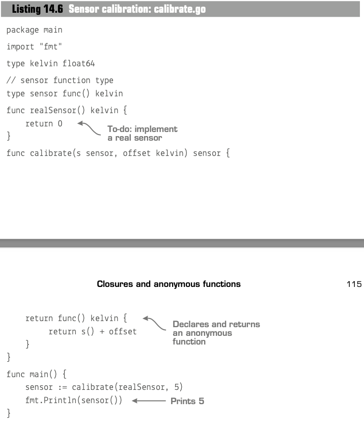
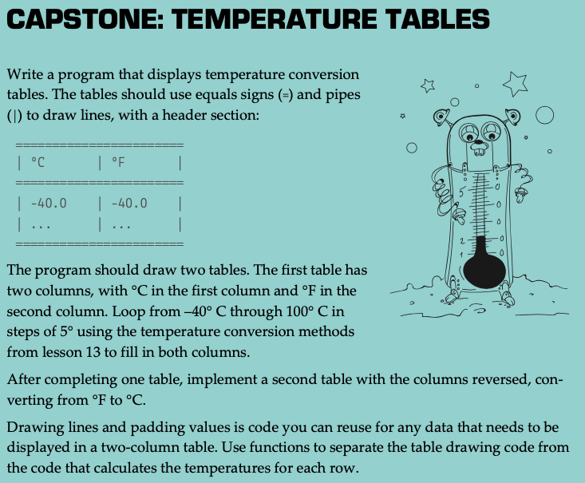
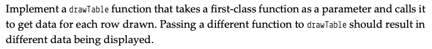

# Function
* objective: make code of an operation in processes reuseable
* declare a function with one `int` parameter and one `int` result
  ```
  func Intn (n int) int
  ```
* passed by value: the passed arguments do not affect the value of the original variable. The only exception is when passing pointer arguments.

# Method
* function belongs to a specific type, except built-in types such as `int` and `float64`
* a method can only link to one type
```
type kelvin float64
type celsius float64

// declare a method linking to kelvin
func (k kelvin) celsius() celsius {
    return celsius(k - 273.15)
}

// use method
func main() {
    var k kelvin = 294.0
    var c celsius

    c = k.celsius()
    fmt.Println(c)
}
```

# First Class function
* function can be treated as other variable, such as arguments and return values in other functions
  ```
  // decalre a function with arguments of a int and float resturn type function
  func measureTemp(sample int, s func() float64)
  ```
* closure: a function use and retain variables from its surrounding scope. Usually happens in the interior anonymous functions
  ```
  func realSensor() float64{
    return 0
  }

  // return func() float64 is a closure hold s and offset values 
  func calibrate(s func() float64, offset float64) func() float64{ 
    return func() float64{
      return s() + 
      offset
    } 
  }

  func main(){
    sensor := calibrate(realSensor, 5)
    fmt.Println(sensor())
  }
  ```
<br>


## Expermiment
- **Expermiment 1**  

  ```
  func kelvinToCelsius(k float64) float64 {
    k -= 273.15
    return k
  }
  ```
  [solution](assignment_3.go#L20)
<br>

- **Expermiment 2**  


[solution](assignment_3.go#L51)
<br>

- **Expermiment 3**  


[solution](capstone_3.go)
<br>