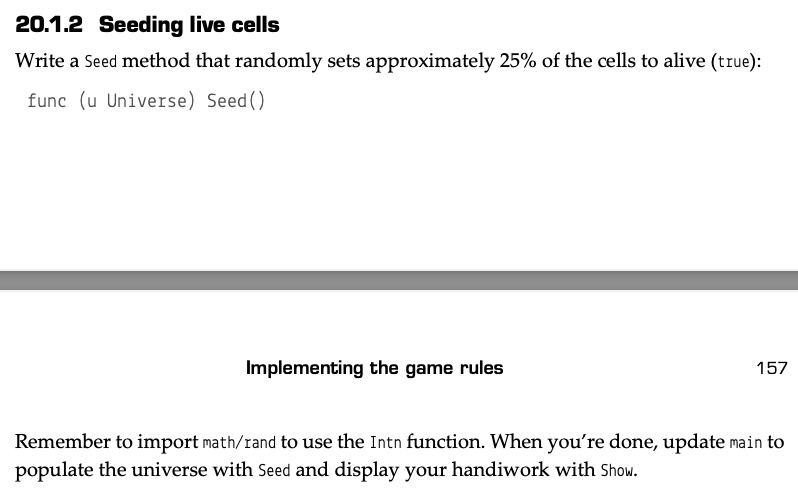

# Array
* a collection of elements with a fixed length and in a specific order
* declare and access
  ```
  // declare array with elements with "0" values
  var planets [8]string

  // access element and assign value
  // should not access element out of range
  planets[0] = "Mercury"

  // declare with composite lieral
  planets := [...]string{"Mercury", "Venus", "Earth", "Mars", "Jupiter", "Saturn", "Uranus", "Neptune"}

  // access length
  fmt.Println(len(planets))
  ```

* traverse
    two ways: `for` and `range` 
    ```
    dwarfs := [5]string{"Ceres", "Pluto", "Haumea", "Makemake", "Eris"}

    for i := 0; i < len(dwarfs); i++ {
        dwarf := dwarfs[i]
        fmt.Println(i, dwarf) 
    }

    for i,dwarfs := range dwarfs {
        fmt.Println(i, dwarf)
    }
    ```

* array copy: as array is value type, when an array is assigned to another variable, a new copy of the entire array is created
* 2 dimension array
  ```
  var board [8][8]string
  ```

# Slice
* partition of an array
* `planets[0:4]` will get elements of index 0, 1, 2, 3
* declare a slice with composite literal:
    ```
    dwarfs := []string{"Ceres", "Pluto", "Haumea", "Makemake", "Eris"}
    ```
* usually use slices instead of arrays as function parameters: 
  * don't  create a copy
  * don't need to predefine length

* sort string slice: `sort.StringSlice().Sort()`
  ```
  sort.StringSlice(planets).Sort()
  ```
* add element to a slice: `append()`
    ```
    dwarfs = append(dwarfs, "Orcus")
    ```
* length of slice: `len(plants)`
* capacity of slice: `cap(plants)`, which is equal to its original array
* limitation of capacity: `[::]`
  ```
  worlds := planets[0:4:4]
  ```
  p.s. without limitation of capacity, append on slice might change its orginal array
* preallocate slices: `make`
    ```
    s := make([]int, 0, 1000) // Preallocate capacity for 1000 elements
    ```
* slice as variadic parameters
    ```
    func sum(numbers ...int) int {
        total := 0
        for _, num := range numbers {
            total += num
        }
        return total
    }

    fmt.Println(sum(1, 2, 3))        // Output: 6
    ```
# Map
* a colliction can map keys to values
* declare a map
    ```
    temperature := map[string]int{
        "Earth":15,
        "Mars": -65
    }
    ```
* check if a key has corresponding value
    ```
    if moon, ok := temperature["Moon"]; ok {
        fmt.Printf("On average the moon is %v° C.\n", moon)
    } else {
        fmt.Println("Where is the moon?")
    }
    ```
* Copy a map: as map is a reference type, copying a map does not not create a new copy
* preallocate map: `make`
  ```
  // create a map reserved for 8 elements
  temperature := make(map[string]int,8)
  ```
* map can be used as counter and set
    ```
    // use map as a counter
    temperatures := []float64{-28.0, 32.0, -31.0, -29.0, -23.0, -29.0, -28.0, -33.0}

    frequency := make(map[float64]int)

    for _, t := range temperatures {
        frequency[t]++
    }

    for t, num := range frequency {
        fmt.Printf("%.2f occurs %d times\n", t, num)
    }
    ```
    * p.s. must initial `map` by `make()`, or it will result in a runtime panic
<br>

## Expermiment
- **Expermiment 1**  


[solution](assignment_4.go#8)
<br>

- **Expermiment 2**  

[solution](assignment_4.go#23)
<br>

- **Expermiment 3**  

[solution](assignment_4.go#34)
<br>

- **Expermiment 4**  


[solution](capstone_4.go)
<br>