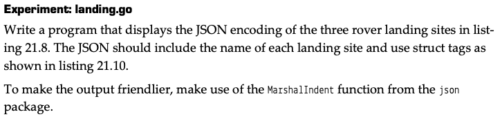
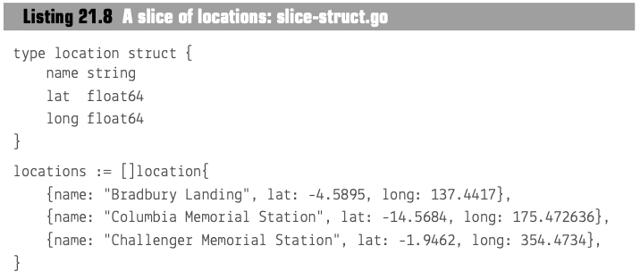
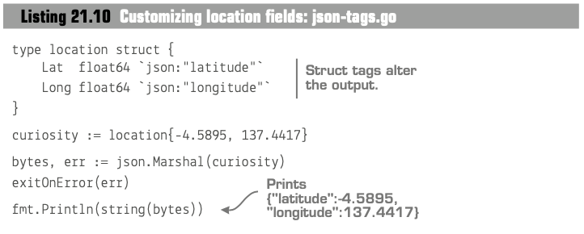
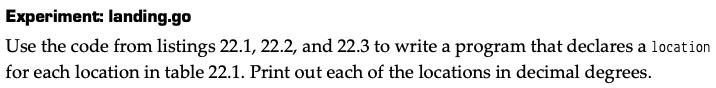
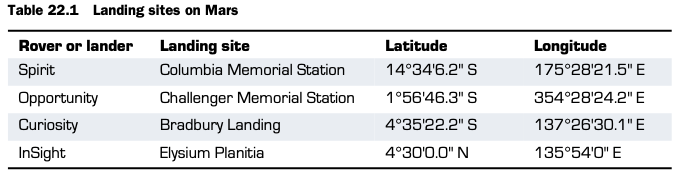
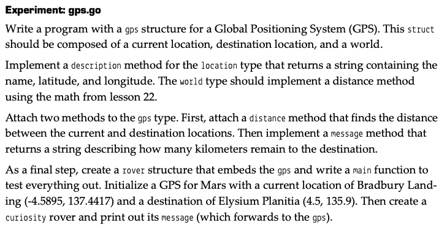
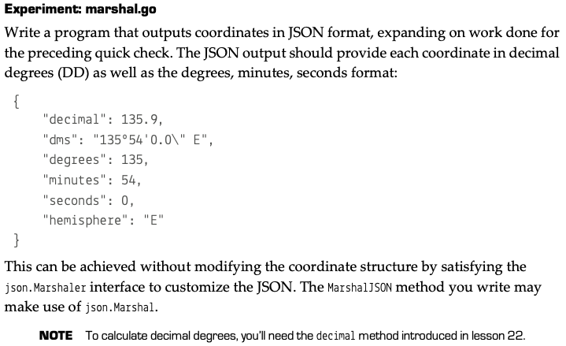

# Struct

* combine different type of variables together
* 
```
// define a struct type
type location struct{
    Lat, Long float64
}

// create an instance of a struct
spirit := location {Lat: -14.5684, Long: 175.472636}

// print out the instance
fmt.printf("%+v\n",spirit)

// copy to another instance
// p.s struct is value type, so a copy is created and assigned
curiosity := spirit

// transfer into JSON
result, err := json.Marshal(spirit)

``` 
# Method
there is no class, inheritat and object in Go, but only strct and method.

```
// define a struct
type coordinate struct{
    d,m,s float64
    h rune
}

// associate a method to a struct
func (c coordinate) demical() float64{
    ...
    return 0.0
}

// constructor: create an instance of a struct, anyname as you want
fun newCoordinate(h rune,d,m,s float64) coordinate{
    return coordinate{d,m,s,h}
}
```

# Composition
Composition is a top-level struct including at least one nested structs, which is used to implement inheritage in OOP

```
// Define the composition: report struct
// nested struct do not need to define field Name
type report struct {
	sol         int
	temperature
	location
}

// Define the temperature struct
type temperature struct {
	high, low float64
}

// Define the location struct
type location struct {
	lat, long float64
}
```
## Forward method
top-level (primary) struct can directly call a method of a nested (secondary) struct

```
// Method to calculate the average temperature
func (t temperature) average() float64 {
	return (t.high + t.low) / 2
}

func main() {
	// Define a location instance
	bradbury := location{-4.5895, 137.4417}

	// Define a temperature instance
	t := temperature{high: -1.0, low: -78.0}

	// Define a report instance
	report := report{
		sol:         15,
		temperature: t,
		location:    bradbury,
	}

	// Print the average temperature
	fmt.Println(report.average())
}
```
p.s. different nested structs cannot have methods with same name 

# Interface
* define what methods neends to be implement
* when create a new struct, there is no need to claim what interface has been implement
* usually define interface as type for reusable
* interface name usually end with 'er' 
* go encourage user to use composition of single method interface rather than inheritage of muti-method structs, such as string() of stringer interface
```
type Stringer interface{
	String() string
}
```
* you can define your String() method to overwrite default implementation
```
func (c coordinate) String() string {
	sign := 1.0
	switch c.h {
	case 'S', 'W':
		sign = -1
	}

	return fmt.Sprintf("%v%v∘%v'%v''%v", sign, c.d, c.m, c.s, string(c.h))
}

c:=coordinate{4, 35, 22.2, 'S'}
fmt.Println(string(c))  // output: -14∘35'22.2''S
```
<br>

## Expermiment
- **Expermiment 1**  



[solution](assignment_5.go#9)
<br>

- **Expermiment 2**  


[solution](assignment_5.go#37)
<br>

- **Expermiment 3**  

[solution](assignment_5.go#80)
<br>

- **Expermiment 4**  

[solution](assignment_5.go#125)
<br>